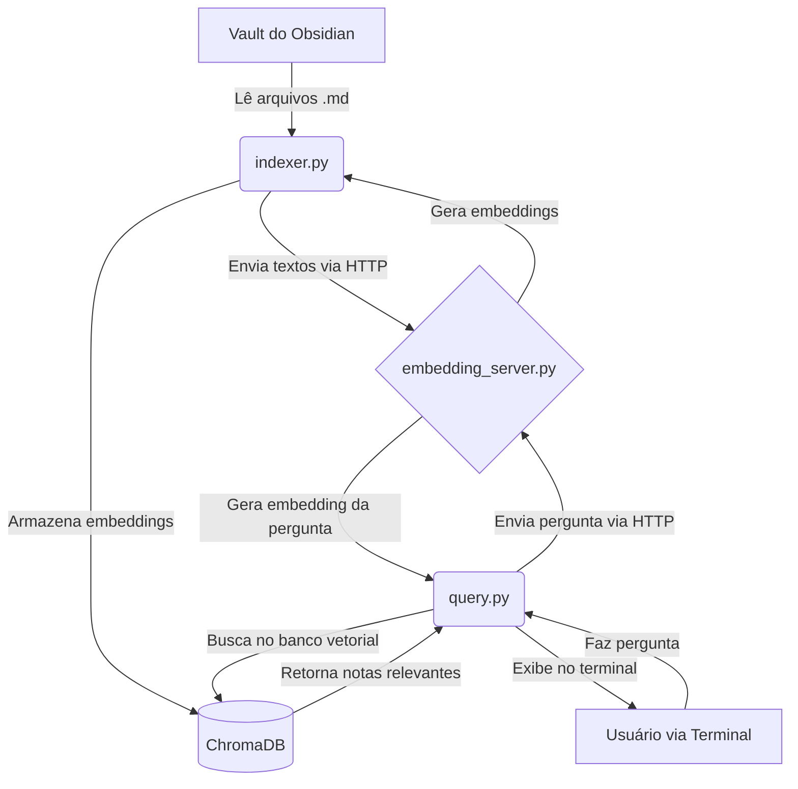

# 🧠 Digital Clone Engine

Este projeto é o motor por trás de um clone digital pessoal, projetado para indexar e pesquisar um vault do Obsidian usando um sistema RAG (Retrieval-Augmented Generation) customizado e local.

O sistema é composto por três componentes principais:
1.  **Servidor de Embeddings (`embedding_server.py`)**: Um microsserviço FastAPI que expõe um modelo de sentence-transformers para gerar embeddings vetoriais a partir de textos.
2.  **Indexador (`indexer.py`)**: Um script que lê todos os documentos de um diretório (como um vault do Obsidian), usa o servidor de embeddings para vetorizá-los e armazena os resultados em um banco de dados vetorial local (ChromaDB).
3.  **Motor de Consulta (`query.py`)**: Uma interface de linha de comando para fazer perguntas em linguagem natural ao seu vault indexado, recuperando as notas mais relevantes.

---

## 🏛️ Arquitetura



---

## 🚀 Guia de Início Rápido

### 1. Pré-requisitos

- Python 3.10+
- Um ambiente virtual (recomendado)

### 2. Instalação

Clone o repositório e instale as dependências:

```bash
# Crie e ative um ambiente virtual
python -m venv venv
source venv/bin/activate

# Instale as dependências
pip install -r requirements.txt
```

### 3. Configuração

Crie um arquivo `.env` na raiz do projeto e adicione o caminho para o seu vault do Obsidian:

```
OBSIDIAN_VAULT_PATH=/caminho/para/seu/vault
```

### 4. Execução

O sistema precisa de dois terminais para rodar (um para o servidor, outro para as operações).

**Terminal 1: Iniciar o Servidor de Embeddings**

Este processo deve permanecer ativo em segundo plano.

```bash
python embedding_server.py
```

**Terminal 2: Indexar o Conteúdo (Executar apenas uma vez ou quando houver mudanças)**

Este comando irá ler todos os seus documentos e criar o banco de dados vetorial em `./chroma_db`.

```bash
python indexer.py
```

**Terminal 2: Fazer uma Consulta**

Depois que a indexação estiver completa, você pode fazer perguntas ao seu vault.

```bash
python query.py "Qual o meu sistema de foco?"
```

---

## 📁 Estrutura do Projeto

```
.digital-clone-engine/
├── venv/                   # Ambiente virtual Python
├── chroma_db/              # Banco de dados vetorial (criado pelo indexador)
├── .env                    # Arquivo de configuração (caminho do vault)
├── embedding_server.py     # Servidor FastAPI para embeddings
├── indexer.py              # Script para indexar os documentos
├── query.py                # Script para consultar o índice
├── requirements.txt        # Lista de dependências Python
└── README.md               # Esta documentação
```
