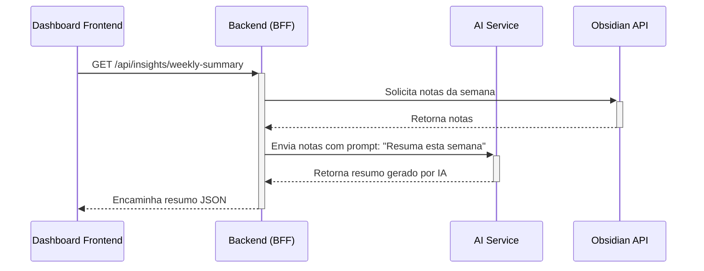
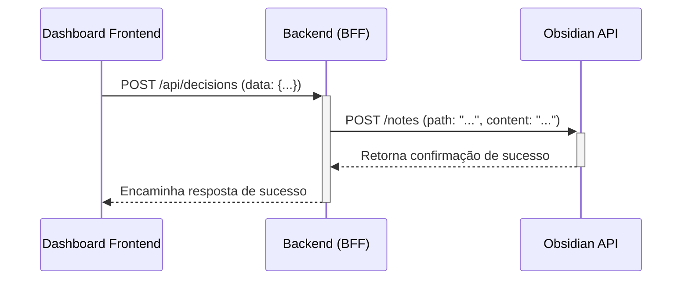

# Documentação da Arquitetura

## Visão Geral do Sistema

O Dashboard do CEO da GG.AI Labs é uma ferramenta estratégica projetada para fornecer inteligência aumentada ao interagir com o Segundo Cérebro de um usuário. A arquitetura segue o padrão **Backend for Frontend (BFF)**, onde um servidor Node.js/Express atua como um orquestrador, simplificando a comunicação entre o frontend e um conjunto de serviços especializados de backend.

## Princípio Arquitetural Central: BFF como Orquestrador

O princípio fundamental da nossa arquitetura é que o **Dashboard Frontend não acessa múltiplos serviços diretamente**. Ele se comunica exclusivamente com o servidor BFF, que por sua vez orquestra chamadas para os serviços necessários, como a API do Obsidian, serviços de IA (OpenAI), banco de dados e cache. Isso desacopla o frontend da complexidade do backend, melhora a segurança e otimiza a performance ao agregar dados em um único local.

### Padrão 1: Lendo e Gerando Insights

Este é o fluxo para gerar insights, combinando dados do Obsidian com a capacidade de um modelo de linguagem.



### Padrão 2: Escrevendo no Segundo Cérebro (Fechando o Ciclo)

Este é o fluxo para criar novo conhecimento, como salvar uma decisão do `DecisionJournal`.




## Arquitetura Futura: Orquestração Multi-Agente (MCP)

O Protocolo de Contexto de Modelo (MCP) está planejado como um orquestrador de nível superior que gerenciará múltiplos agentes de IA especializados, sendo o Cognito o mais importante: o **"Agente do Eu" (Self-Agent)**.

```mermaid
graph TD
    A[Requisição do Usuário] --> B{Orquestrador MCP};
    B --> C[Agente de Mercado];
    B --> D[Cognito "Agente do Eu"];
    B --> E[Agente de Escrita];
    C --> F[APIs Externas];
    D --> G[Cofre do Obsidian];
    C --> B;
    D --> B;
    E --> B;
    B --> H[Saída Final para o Dashboard];
```

## Tecnologias Utilizadas (Stack)

### Stack do Frontend
- **Framework de UI**: React 18
- **Segurança de Tipos**: TypeScript
- **Ferramenta de Build**: Vite
- **Estilização**: Tailwind CSS
- **Ícones**: Lucide React
- **Notificações**: React Hot Toast

### Arquitetura do Frontend

A arquitetura do frontend é projetada para ser modular, segura e de fácil manutenção, seguindo os princípios do React moderno.

- **Componentes Focados**: Componentes como o `DecisionJournal.tsx` são mantidos com uma única responsabilidade. No caso do `DecisionJournal`, sua função foi refatorada para ser exclusivamente a de capturar e enviar novas decisões, removendo toda a lógica de listagem e analytics, que pode ser delegada a outros componentes.

- **Serviços Centralizados**: A comunicação com o backend é gerenciada de forma centralizada para garantir consistência e segurança de tipos:
  - **`apiClient.ts`**: Uma classe singleton que encapsula toda a lógica de requisições HTTP (`fetch`). Ela é responsável por configurar headers, tratar a serialização de dados (JSON) e padronizar o tratamento de erros.
  - **`useAPI.ts`**: Um hook customizado que serve como a principal ponte entre os componentes React e o `apiClient`. Ele provê a instância do `apiClient` e o estado da conexão com o backend (`isConnected`, `error`), permitindo que a UI reaja dinamicamente à saúde da API.

### Stack do Backend (Servidor BFF)
- **Servidor da API**: Node.js/Express
- **Cliente HTTP**: node-fetch
- **Persistência Local**: SQLite (para dados não relacionados ao conhecimento)
- **Cache**: Redis

## Segurança e Escalabilidade (Planejado)

- **Segurança**: O modelo centrado no Cognito é inerentemente mais seguro. Trabalhos futuros incluem autenticação de usuário baseada em JWT para o próprio dashboard.
- **Escalabilidade**: O backend é projetado para ser stateless, permitindo escalonamento horizontal. O próprio Cognito é projetado como um microsserviço escalável e separado.