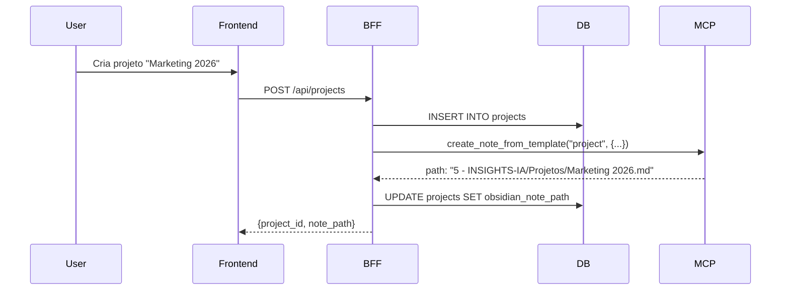
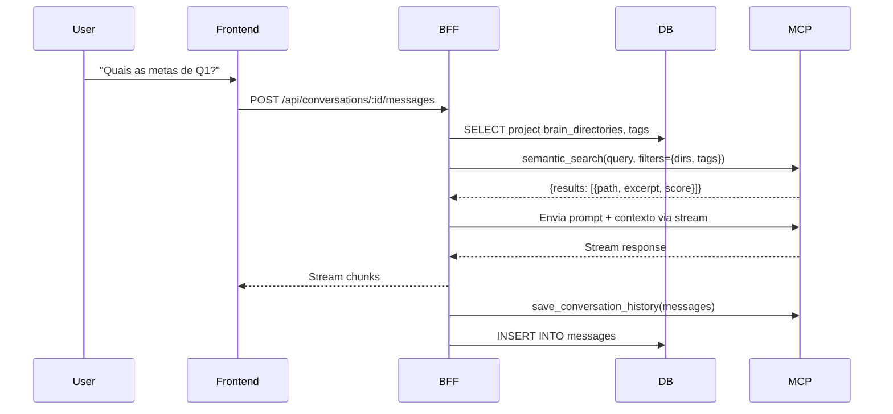
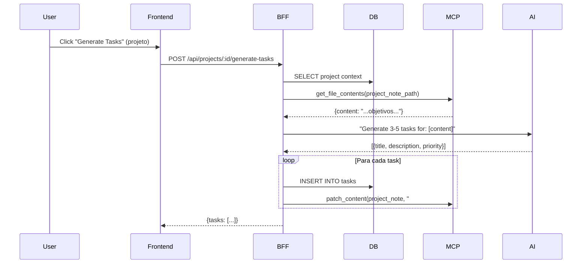
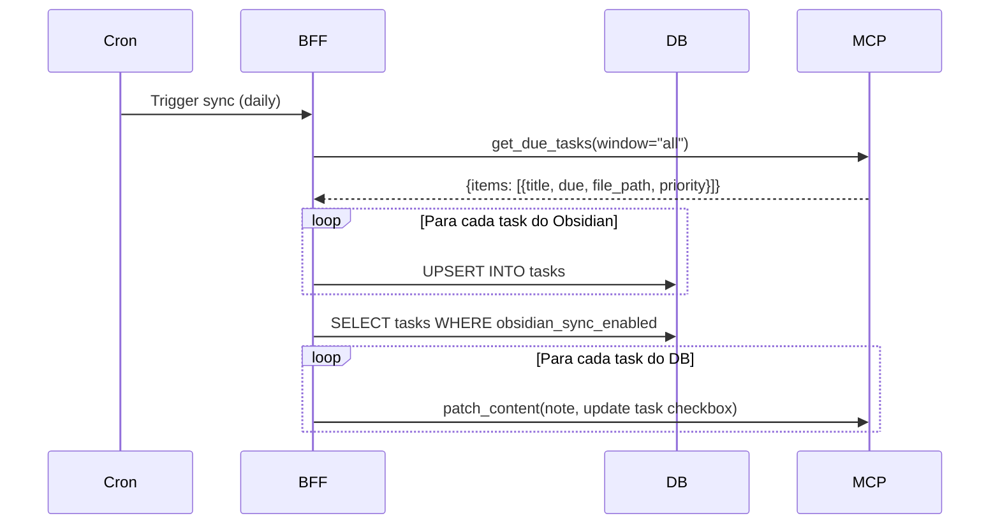

# Plano de Integração: CEO Dashboard + Obsidian Brain Cloud + Vectal.ai UX

## 🎯 Visão Geral

Sistema **multi-tenant** que combina:
- **Vectal.ai**: Referência de UX/UI (projects, tasks, chats, workflows)
- **Obsidian Brain Cloud**: Backend MCP como fonte de conhecimento
- **CEO Dashboard**: Camada de negócio multi-tenant

---

## 🏗️ Arquitetura Integrada

```
┌─────────────────────────────────────────────────────────────┐
│                     CEO Dashboard (Frontend)                 │
│  ┌─────────┬─────────┬─────────┬─────────┬─────────┐       │
│  │Projects │  Tasks  │  Chats  │ Agents  │Knowledge│       │
│  └─────────┴─────────┴─────────┴─────────┴─────────┘       │
└──────────────────────┬──────────────────────────────────────┘
                       │
                       ▼
┌─────────────────────────────────────────────────────────────┐
│              BFF Layer (Node.js/Express)                     │
│  ┌──────────────────┬────────────────┬──────────────────┐  │
│  │  Auth/Tenant     │   PostgreSQL   │   MCP Client     │  │
│  │  Middleware      │   (Multi-tenant)│  (Obsidian)     │  │
│  └──────────────────┴────────────────┴──────────────────┘  │
└───────────────────┬──────────────────┬──────────────────────┘
                    │                  │
        ┌───────────▼─────────┐       │
        │   PostgreSQL        │       │
        │  - users            │       │
        │  - tenants          │       │
        │  - conversations    │       │
        │  - projects         │       │
        │  - tasks            │       │
        └─────────────────────┘       │
                                      │
                    ┌─────────────────▼──────────────────┐
                    │  Obsidian Brain Cloud (MCP)        │
                    │  - Vault Notes (Markdown)          │
                    │  - Semantic Search (Embeddings)    │
                    │  - Tasks (due dates)               │
                    │  - Templates                       │
                    │  - Conversation Memory             │
                    └────────────────────────────────────┘
```

---

## 📊 Modelo de Dados Híbrido

### **PostgreSQL** (Multi-tenant, Relacional)

Armazena dados **transacionais e de negócio**:

```sql
-- Tenants & Users (já definidos)
CREATE TABLE tenants (...);
CREATE TABLE users (...);

-- Projects (inspirado no Vectal)
CREATE TABLE projects (
  id UUID PRIMARY KEY DEFAULT gen_random_uuid(),
  tenant_id UUID REFERENCES tenants(id) ON DELETE CASCADE,
  user_id UUID REFERENCES users(id) ON DELETE CASCADE,

  name VARCHAR(255) NOT NULL,
  description TEXT,
  color VARCHAR(50) DEFAULT 'blue',

  -- System prompt customizado por projeto
  system_prompt TEXT,

  -- Contexto do Brain Cloud
  brain_context_enabled BOOLEAN DEFAULT true,
  brain_directories TEXT[] DEFAULT '{}', -- Filtros de diretórios
  brain_tags TEXT[] DEFAULT '{}',        -- Filtros de tags

  -- Workflow automation
  auto_task_generation BOOLEAN DEFAULT false,
  auto_insights BOOLEAN DEFAULT true,

  status VARCHAR(50) DEFAULT 'active',
  is_shared BOOLEAN DEFAULT false,

  created_at TIMESTAMP DEFAULT NOW(),
  updated_at TIMESTAMP DEFAULT NOW()
);

-- Tasks (integra com Obsidian due dates)
CREATE TABLE tasks (
  id UUID PRIMARY KEY DEFAULT gen_random_uuid(),
  tenant_id UUID REFERENCES tenants(id) ON DELETE CASCADE,
  user_id UUID REFERENCES users(id) ON DELETE CASCADE,
  project_id UUID REFERENCES projects(id) ON DELETE CASCADE,

  title VARCHAR(500) NOT NULL,
  description TEXT,

  -- Sync com Obsidian
  obsidian_note_path TEXT,         -- Path da nota no vault
  obsidian_sync_enabled BOOLEAN DEFAULT false,

  -- Task metadata
  status VARCHAR(50) DEFAULT 'pending', -- pending, in_progress, completed
  priority VARCHAR(50),                 -- P0, P1, P2, P3
  importance INTEGER DEFAULT 50,        -- 0-100

  -- Dates
  due_date TIMESTAMP,
  completed_at TIMESTAMP,

  -- Subtasks (JSON array)
  subtasks JSONB DEFAULT '[]',

  -- AI Generated
  ai_generated BOOLEAN DEFAULT false,
  ai_suggestions JSONB DEFAULT '{}',

  created_at TIMESTAMP DEFAULT NOW(),
  updated_at TIMESTAMP DEFAULT NOW()
);

CREATE INDEX idx_tasks_project ON tasks(project_id);
CREATE INDEX idx_tasks_due_date ON tasks(due_date);
CREATE INDEX idx_tasks_status ON tasks(status);

-- Conversations (contexto por projeto)
CREATE TABLE conversations (
  id UUID PRIMARY KEY DEFAULT gen_random_uuid(),
  tenant_id UUID REFERENCES tenants(id) ON DELETE CASCADE,
  user_id UUID REFERENCES users(id) ON DELETE CASCADE,
  project_id UUID REFERENCES projects(id) ON DELETE SET NULL,

  title VARCHAR(500) NOT NULL,
  summary TEXT,

  -- System prompt (herda do projeto ou customizado)
  system_prompt TEXT,

  -- Brain context config
  brain_context_enabled BOOLEAN DEFAULT true,
  brain_context_snapshot JSONB DEFAULT '{}', -- Notas usadas

  -- Stats
  message_count INTEGER DEFAULT 0,
  total_tokens INTEGER DEFAULT 0,

  -- Sync com Obsidian Brain Cloud
  obsidian_conversation_id TEXT,  -- ID no banco de memória do MCP
  obsidian_note_path TEXT,        -- Path se salvo como nota

  status VARCHAR(50) DEFAULT 'active',
  created_at TIMESTAMP DEFAULT NOW(),
  updated_at TIMESTAMP DEFAULT NOW()
);

-- Messages (já definido, adicionar project_id)
ALTER TABLE messages ADD COLUMN project_id UUID REFERENCES projects(id);

-- Workflows (inspirado no Vectal)
CREATE TABLE workflows (
  id UUID PRIMARY KEY DEFAULT gen_random_uuid(),
  tenant_id UUID REFERENCES tenants(id) ON DELETE CASCADE,
  user_id UUID REFERENCES users(id) ON DELETE CASCADE,
  project_id UUID REFERENCES projects(id) ON DELETE SET NULL,

  name VARCHAR(255) NOT NULL,
  description TEXT,

  -- Trigger config
  trigger_type VARCHAR(100) NOT NULL, -- chat_message_sent, task_completed, etc
  trigger_config JSONB DEFAULT '{}',

  -- Action config
  action_type VARCHAR(100) NOT NULL,  -- save_memory, create_task, etc
  action_config JSONB DEFAULT '{}',

  is_active BOOLEAN DEFAULT true,
  is_template BOOLEAN DEFAULT false,

  -- Stats
  total_executions INTEGER DEFAULT 0,
  last_executed_at TIMESTAMP,

  created_at TIMESTAMP DEFAULT NOW(),
  updated_at TIMESTAMP DEFAULT NOW()
);

CREATE INDEX idx_workflows_trigger ON workflows(trigger_type);
CREATE INDEX idx_workflows_project ON workflows(project_id);
```

### **Obsidian Brain Cloud** (Conhecimento, Markdown)

Armazena **conhecimento não estruturado**:

- **Notas Markdown** - Conhecimento do usuário
- **Tasks com due dates** - Via frontmatter/checkboxes
- **Conversas persistidas** - Via `save_conversation_history`
- **Embeddings semânticos** - Para busca RAG
- **Templates** - Criação de notas

---

## 🔄 Fluxos de Integração

### 1. **Criar Projeto**



### 2. **Chat com Contexto do Projeto**



### 3. **Gerar Tasks com IA (Vectal-style)**



### 4. **Sync Tasks com Obsidian**



### 5. **Workflow: Save Memory on Chat**

```mermaid
sequenceDiagram
    participant Chat
    participant BFF
    participant DB
    participant MCP

    Chat->>BFF: POST /api/conversations/:id/messages (last msg)
    BFF->>DB: SELECT workflow WHERE trigger="chat_message_sent"
    BFF->>MCP: save_conversation_history({
      source: "ceo_dashboard",
      conversation_id,
      messages,
      metadata: {project, tags}
    })
    MCP-->>BFF: {database_id, note_path}
    BFF->>DB: UPDATE conversations SET obsidian_conversation_id
```

---

## 🎨 Frontend (Estilo Vectal.ai)

### **Estrutura de Rotas**

```
/                      → Dashboard Today (BusinessIntelligenceHub)
/projects              → Lista de projetos
/projects/:id          → Detalhes do projeto (Tasks + Chat + Notes)
/projects/:id/chat     → Chat dedicado do projeto
/chat                  → Chat global (Cognito)
/knowledge-graph       → Grafo visual
/decision-journal      → Decisões
/agents                → Agentes IA
/workflows             → Automações (novo)
/settings              → Configurações
```

### **Componentes Principais**

```tsx
// ProjectCard.tsx
interface Project {
  id: string;
  name: string;
  description: string;
  color: string;
  system_prompt: string;
  taskCount: number;
  conversationCount: number;
  obsidian_note_path?: string;
}

// ProjectDetailPage.tsx
- Tabs: Overview | Tasks | Chat | Knowledge | Settings
- System prompt editor
- AI task generation
- Brain context filters (directories, tags)

// TaskCard.tsx (Vectal-style)
- AI-generated subtasks
- Sync status com Obsidian
- Due date picker
- Priority selector (P0-P3)

// WorkflowBuilder.tsx
- Trigger selector (chat_message, task_completed, etc)
- Action selector (save_memory, create_task, etc)
- Template library
```

---

## 🔌 API Endpoints

### **Projects**
```
GET    /api/projects              - List projects
POST   /api/projects              - Create project (+ create note in Obsidian)
GET    /api/projects/:id          - Get project
PUT    /api/projects/:id          - Update project
DELETE /api/projects/:id          - Delete project

POST   /api/projects/:id/generate-tasks  - AI task generation
GET    /api/projects/:id/knowledge        - Brain context (via MCP)
POST   /api/projects/:id/sync             - Sync with Obsidian
```

### **Tasks**
```
GET    /api/tasks                 - List tasks (filter by project)
POST   /api/tasks                 - Create task (+ patch Obsidian note)
GET    /api/tasks/:id             - Get task
PUT    /api/tasks/:id             - Update task
DELETE /api/tasks/:id             - Delete task

POST   /api/tasks/:id/complete    - Mark complete
POST   /api/tasks/sync            - Sync all with Obsidian
```

### **Conversations** (já definido)
```
GET    /api/conversations         - List conversations
POST   /api/conversations         - Create conversation
POST   /api/conversations/:id/messages - Send message (with Brain context)
```

### **Workflows** (novo)
```
GET    /api/workflows             - List workflows
POST   /api/workflows             - Create workflow
PUT    /api/workflows/:id         - Update workflow
DELETE /api/workflows/:id         - Delete workflow
POST   /api/workflows/:id/execute - Manual execution
```

### **Brain Cloud Proxy** (MCP)
```
POST   /api/brain/search          - semantic_search
POST   /api/brain/notes           - create/update notes
GET    /api/brain/graph           - get_graph_data
GET    /api/brain/tasks           - get_due_tasks
POST   /api/brain/memory          - save_conversation_history
```

---

## 🔧 Implementação por Fases

### **Fase 1 - Fundação Multi-Tenant** ✅ (Completo)
- [x] Documentação de arquitetura
- [ ] Migrations PostgreSQL
- [ ] Auth middleware JWT
- [ ] Tenant context middleware

### **Fase 2 - Integração MCP**
- [ ] Cliente MCP para Obsidian Brain Cloud
- [ ] Proxy endpoints (`/api/brain/*`)
- [ ] Configuração por usuário (vault_path, mcp_url)
- [ ] Health check e status do vault

### **Fase 3 - Projects**
- [ ] CRUD de projects
- [ ] Criação de nota no Obsidian ao criar projeto
- [ ] Filtros de contexto (directories, tags)
- [ ] System prompts customizados

### **Fase 4 - Tasks Inteligentes**
- [ ] CRUD de tasks
- [ ] AI task generation (via Claude)
- [ ] Sync bidirecional com Obsidian
- [ ] Subtasks e checklist

### **Fase 5 - Chat Contextual**
- [ ] Chat por projeto
- [ ] Brain context automático (semantic_search)
- [ ] Persistência de conversas (MCP memory)
- [ ] Interface Vectal-style (sidebar + central + context)

### **Fase 6 - Workflows**
- [ ] Workflow builder
- [ ] Triggers (eventos)
- [ ] Actions (save_memory, create_task, etc)
- [ ] Templates de workflows

### **Fase 7 - Polish & Deploy**
- [ ] Cache (Redis)
- [ ] Background jobs (sync, embeddings)
- [ ] Monitoring (logs, metrics)
- [ ] CI/CD pipeline

---

## 🎯 Diferenciais do Sistema

1. **Multi-Tenant Real** - Múltiplas organizações isoladas
2. **Projetos Contextuais** - System prompts + Brain filters
3. **Tasks Inteligentes** - AI generation + sync Obsidian
4. **Chat Híbrido** - RAG via MCP + conversas persistidas
5. **Workflows Automáticos** - Estilo Vectal.ai
6. **Segundo Cérebro Real** - Obsidian como fonte de verdade

---

## 📚 Stack Tecnológico

### Frontend
- React 18 + TypeScript
- Tailwind CSS
- React Router
- React Markdown
- Zustand (state management)

### Backend
- Node.js + Express
- PostgreSQL (multi-tenant)
- Redis (cache + sessions)
- MCP Client (Obsidian integration)
- JWT auth

### Integrações
- **Obsidian Brain Cloud** - MCP (WebSocket/HTTP)
- **Claude API** - AI task generation, chat
- **Voyage AI** - Embeddings (via MCP)

---

## 🚀 Próximo Passo Imediato

Vou criar as **migrations do PostgreSQL** e o **MCP Client** para começar a integração com o Obsidian Brain Cloud.

Posso prosseguir?
