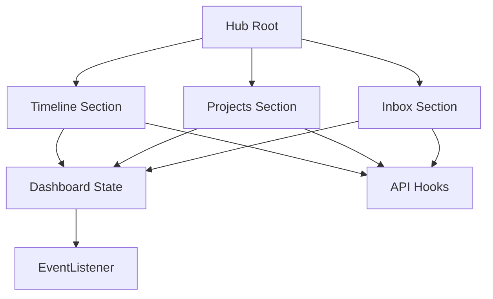

# PROMPT AGENT 3 - ESLint Cleanup + Hub Decomposition Prep

## 🎯 Objetivo
Melhorar qualidade de código e preparar decomposition do BusinessIntelligenceHub.

## 📋 Contexto
- Sprint 2: 97% completo
- ESLint: 5 errors, 73 warnings
- Hub: 3858 linhas (precisa decomposition)
- Próxima sprint: Hub refactor será tarefa crítica

## 🛠️ Tarefas

---

## PARTE 1: ESLint Cleanup (1.5-2h)

### 1.1. Analisar Errors Atuais

```bash
npm run lint 2>&1 | grep "error"
```

**Errors conhecidos:**
```
next-env.d.ts:3  error  Triple-slash reference
tests/e2e/helpers.ts:13,17  error  React Hooks outside component
```

### 1.2. Corrigir tests/e2e/helpers.ts

**Problema:** React Hooks (`use()`) sendo chamados fora de componentes

**Localização:** `tests/e2e/helpers.ts:13,17`

**Soluções possíveis:**

a) **Remover uso de hooks** (se for helper puro)
```typescript
// Se for helper de teste, não deve usar hooks
export const login = async (page) => {
  // Usar API diretamente, sem hooks
};
```

b) **Mover para dentro de componente** (se precisar de hooks)
```typescript
// Criar um componente de teste
export const TestWrapper = ({ children }) => {
  const client = use(someContext);
  return <div>{children}</div>;
};
```

c) **Renomear função** (se for hook customizado)
```typescript
// De: login() → Para: useLogin()
export const useLogin = () => {
  const client = use(authContext);
  return { login: () => {} };
};
```

**Ação:** Leia o arquivo, identifique o problema, aplique a solução adequada.

### 1.3. next-env.d.ts (não mexer)

**Error:**
```
next-env.d.ts:3  error  Triple-slash reference
```

**Ação:** IGNORAR - arquivo gerado pelo Next.js, não deve ser editado.

Se necessário, adicionar ao `.eslintrc.json`:
```json
{
  "overrides": [
    {
      "files": ["next-env.d.ts"],
      "rules": {
        "@typescript-eslint/triple-slash-reference": "off"
      }
    }
  ]
}
```

### 1.4. Reduzir Warnings Críticos

**Target:** 73 warnings → <50 warnings

**Priorizar:**
- `@typescript-eslint/no-unused-vars` (variáveis não usadas)
- `@typescript-eslint/no-explicit-any` (any types)
- `prefer-const` (let → const)

**Comando:**
```bash
npm run lint -- --fix
```

**Validação final:**
```bash
npm run lint 2>&1 | tail -3
```

**Target:**
```
✖ X problems (0 errors, <50 warnings)
```

---

## PARTE 2: Hub Decomposition Analysis (2-3h)

### 2.1. Análise Quantitativa do Hub

**Arquivo:** `src/components/BusinessIntelligenceHub.tsx` (3858 linhas)

**Métricas a coletar:**

```bash
# 1. Contar hooks
grep -E "useState|useEffect|useCallback|useMemo|useRef" src/components/BusinessIntelligenceHub.tsx | wc -l

# 2. Contar handlers
grep -E "const handle[A-Z]" src/components/BusinessIntelligenceHub.tsx | wc -l

# 3. Contar seções JSX
grep -E "<(div|section).*className.*flex" src/components/BusinessIntelligenceHub.tsx | wc -l
```

**Criar tabela:**
```markdown
| Métrica              | Quantidade | Nota                    |
|----------------------|------------|-------------------------|
| Linhas totais        | 3858       | 🔴 Muito grande         |
| useState             | X          |                         |
| useEffect            | X          |                         |
| useCallback          | X          |                         |
| useMemo              | X          |                         |
| useRef               | X          |                         |
| Handlers (handleX)   | X          |                         |
| Seções visuais       | X          | Possíveis componentes   |
| Imports              | X          |                         |
| Props                | X          |                         |
```

### 2.2. Identificar Responsabilidades

**Leia o arquivo e identifique seções lógicas:**

Exemplo de estrutura comum:
```typescript
// 1. IMPORTS (linhas 1-64)
// 2. TIPOS (linhas 65-150)
// 3. ESTADO - Dashboard Data (linhas 200-300)
// 4. ESTADO - UI State (linhas 301-400)
// 5. HANDLERS - Tasks (linhas 500-700)
// 6. HANDLERS - Projects (linhas 701-900)
// 7. HANDLERS - Inbox (linhas 901-1100)
// 8. EFFECTS - Data fetching (linhas 1200-1500)
// 9. EFFECTS - Event listeners (linhas 1501-1700)
// 10. JSX - Timeline (linhas 2000-2500)
// 11. JSX - Projects (linhas 2501-3000)
// 12. JSX - Inbox (linhas 3001-3500)
// 13. JSX - Layout (linhas 3501-3858)
```

**Documente:**
```markdown
### Seções Identificadas

#### 1. Timeline Section (linhas X-Y)
- **Estado:** [lista de useState usados]
- **Handlers:** [lista de funções]
- **Dependências:** [outros hooks/funções usadas]
- **Complexidade:** Alta/Média/Baixa
- **Pode extrair?** ✅ Sim / ❌ Não (motivo)

#### 2. Projects Section (linhas X-Y)
...
```

### 2.3. Propor Componentes

**Para cada seção identificada, propor componente:**

```markdown
### Componente 1: TimelineView
**Linhas:** 2000-2500
**Responsabilidade:** Exibir timeline de eventos
**Estado próprio:**
- timelineEvents: TimelineCard[]
- selectedEvent: string | null
- filter: TimelineFilter

**Props necessárias:**
- events: TimelineCard[]
- onEventSelect: (id: string) => void
- onFilter: (filter: TimelineFilter) => void

**Handlers a mover:**
- handleEventClick
- handleFilterChange
- handleTimelineScroll

**Benefícios:**
- Reduz Hub em ~500 linhas
- Isolamento de responsabilidade
- Facilita testes unitários
- Reutilizável em outras páginas

**Riscos:**
- Depende de API context (mitigar com props)
- Compartilha estado com Projects (usar Context?)
```

### 2.4. Dependency Graph

**Criar grafo de dependências entre seções:**



**Identificar:**
- ✅ Seções independentes (extrair primeiro)
- ⚠️ Seções com dependências (extrair depois)
- 🔴 Seções fortemente acopladas (context necessário)

### 2.5. Migration Strategy

**Propor ordem de extração (menos arriscado → mais arriscado):**

```markdown
### Fase 1: Componentes Visuais Puros (1-2h)
1. TimelineCard component (já pode existir)
2. ProjectCard component
3. InboxNoteCard component
4. StatsWidget component

**Risco:** Baixo
**Impacto:** Reduz ~300 linhas

### Fase 2: Seções Independentes (2-3h)
1. TimelineView component
2. ProjectsView component
3. InboxView component

**Risco:** Médio
**Impacto:** Reduz ~1500 linhas

### Fase 3: State Management (3-4h)
1. Criar DashboardContext
2. Mover estado compartilhado
3. Migrar handlers para context

**Risco:** Alto
**Impacto:** Simplifica Hub significativamente

### Fase 4: Layout Refactor (1-2h)
1. Hub vira container
2. Renderiza componentes filhos
3. Gerencia layout/grid

**Risco:** Baixo (última fase)
**Impacto:** Hub final: ~500-800 linhas ✅
```

---

## PARTE 3: Code Smells Report (1h)

### 3.1. Scan Automático

**Comando:**
```bash
# Funções grandes (>50 linhas)
grep -n "^\s*const\s\+\w\+\s*=\s*(" src/components/*.tsx | while read line; do
  # Analisar tamanho da função
done

# Arquivos grandes (>300 linhas, exceto Hub)
find src/components -name "*.tsx" -exec wc -l {} \; | sort -rn | head -20

# useEffect sem cleanup
grep -A 10 "useEffect" src/components/*.tsx | grep -v "return () =>"

# Any types
grep -n ": any" src/**/*.{ts,tsx}
```

### 3.2. Documentar Problemas

**Criar:** `docs/CODE_SMELLS_REPORT.md`

**Estrutura:**
```markdown
# Code Smells Report

## 1. Arquivos Grandes (>300 linhas)

| Arquivo | Linhas | Prioridade | Solução Proposta |
|---------|--------|------------|------------------|
| BusinessIntelligenceHub.tsx | 3858 | 🔴 Alta | Decomposition |
| ... | ... | ... | ... |

## 2. Funções Grandes (>50 linhas)

| Arquivo:Função | Linhas | Problema | Solução |
|----------------|--------|----------|---------|
| Hub:handleTaskEvent | 120 | Lógica complexa | Extrair helpers |

## 3. useEffect sem Cleanup

| Arquivo:Linha | Risco | Fix Necessário |
|---------------|-------|----------------|
| Component.tsx:42 | addEventListener | Adicionar removeEventListener |

## 4. Type Safety Issues

| Arquivo:Linha | Problema | Fix |
|---------------|----------|-----|
| api.ts:15 | any type | Definir interface |

## 5. Prop Drilling (>3 níveis)

| Componente | Props Passadas | Níveis | Solução |
|------------|----------------|--------|---------|
| Hub → Timeline → Card → Button | onEventClick | 4 | Context API |

## 6. Duplicação de Código

| Padrão | Ocorrências | Localização | Refactor |
|--------|-------------|-------------|----------|
| API error handling | 15× | Vários arquivos | Criar useAPIWithError hook |
```

---

## 📦 Entregáveis

### 1. ESLint Cleanup
- ✅ `tests/e2e/helpers.ts` corrigido
- ✅ ESLint errors: 5 → 0 ou 1 (next-env ignorado)
- ✅ ESLint warnings: 73 → <50

### 2. Hub Decomposition Strategy
- 📄 `docs/HUB_DECOMPOSITION_PHASE3.md` (estratégia completa)
  - Análise quantitativa
  - Componentes propostos (10-15 componentes)
  - Dependency graph
  - Migration strategy (4 fases)
  - Risk assessment
  - Rollback plan

### 3. Code Quality Report
- 📄 `docs/CODE_SMELLS_REPORT.md`
  - Arquivos grandes
  - Funções grandes
  - useEffect sem cleanup
  - Type safety issues
  - Prop drilling
  - Duplicação de código

### 4. Roadmap Sprint 3.5
- 🗓️ Plano de execução detalhado
- ⏱️ Estimativas de tempo por fase
- 🎯 Critérios de sucesso
- 🚨 Plano de contingência

---

## ✅ Critério de Sucesso

### ESLint:
```bash
npm run lint
# Output esperado:
✖ X problems (0 errors, <50 warnings)
```

### Documentação:
- ✅ HUB_DECOMPOSITION_PHASE3.md completo e detalhado
- ✅ CODE_SMELLS_REPORT.md com >20 issues identificados
- ✅ Estratégia aprovada para execução

### Qualidade da Análise:
- ✅ Todos os componentes identificados
- ✅ Dependências mapeadas
- ✅ Riscos avaliados
- ✅ Ordem de migração definida

---

## ⏱️ Estimativa de Tempo

- ESLint cleanup: 1.5-2h
- Hub analysis: 2-3h
- Code smells report: 1h
- **TOTAL: ~4-6h**

---

## 💡 Dicas

1. **Use grep/awk para automatizar análise** (economiza tempo)
2. **Priorize issues com maior impacto** (não precisa documentar tudo)
3. **Foque em decomposition strategy** (é o entregável mais crítico)
4. **Seja específico nas linhas** (facilita execução posterior)
5. **Proponha soluções práticas** (não apenas identifique problemas)

**Boa sorte! 🎯**
